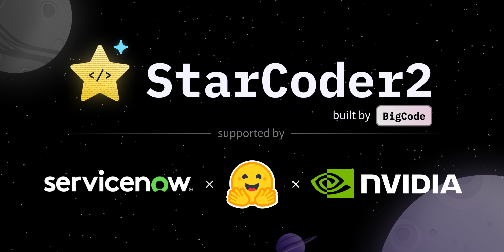

# Highlights

</img>

This project demonstrates the process of fine-tuning the Starcoder2-3B model, a code-generating LLM, on proprietary code, which we could imagine as a company's internal codebase, to better align with internal coding standards and leverage specialized libraries. Given the substantial size of these models, traditional fine-tuning approaches can be excessively demanding on computational resources. However, we'll introduce techniques to effectively fine-tune these models on just a single GPU using QLoRA, PEFT, and Bits and Bytes, ensuring a more practical approach for resource-limited environments.

See my [website](https://jordandeklerk.github.io/project/starcoder/) for the full project.
